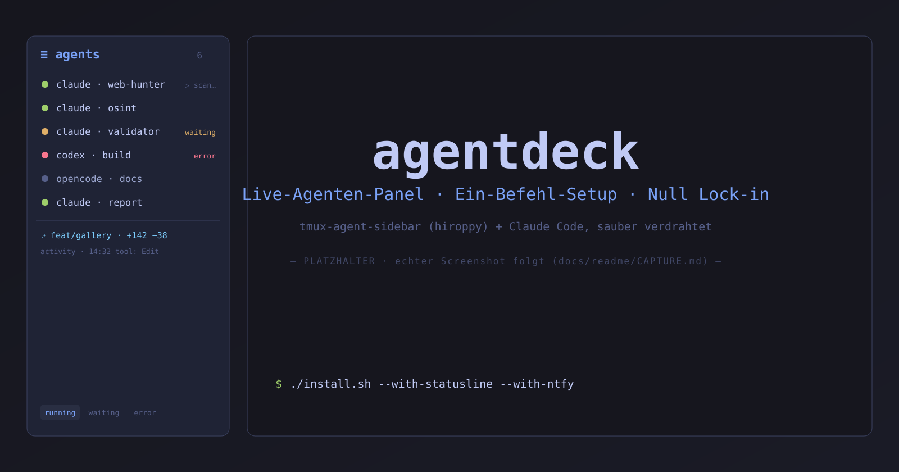
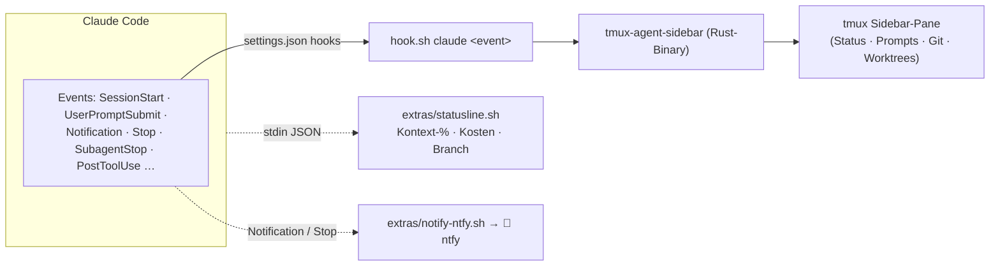

<div align="center">



# agentdeck

### Die Integrationsschicht, die hiroppys `tmux-agent-sidebar` in Claude Code bringt — in einem Befehl.

**Live-Agenten-Panel · Ein-Befehl-Setup · Null Lock-in**


</div>

---

## Über das Projekt

[`tmux-agent-sidebar`](https://github.com/hiroppy/tmux-agent-sidebar) von hiroppy ist ein exzellentes
Rust-Tool: eine tmux-Sidebar, die **jedes Claude-Code-, Codex- und OpenCode-Pane über alle Sessions
und Fenster hinweg** live überwacht — Status, Prompts, Tool-Calls, Git-Stand, Worktrees.

**agentdeck ist kein Fork und kein Re-Upload dieses Tools.** Es ist die **Integrationsschicht**
drumherum: ein additiver Ein-Befehl-Installer, saubere Config-Snippets, ein verifizierter
Statusline- und ein Remote-Notification-Baustein, ehrliche Betriebsdoku und ein chirurgischer Rückbau
— alles auf ein **headless-VPS-/SSH-Setup ohne TPM** zugeschnitten (wie `tmux-resurrect`/`continuum`).

> **Inhalt:** [Highlights](#highlights) · [Quickstart](#quickstart) · [Wie es funktioniert](#wie-es-funktioniert)
> · [Konfiguration](#konfiguration) · [Keybinds](#keybinds) · [Senior-Extras](#senior-extras)
> · [Headless-Realität](#headless-realität-ehrlich) · [Rückbau](#rückbau) · [Danke · Upstream](#danke--upstream)

---

## Highlights

- 🧩 **Ein Befehl, additiv** — `install.sh` hängt nur an und legt vor jeder Änderung Backups an,
  überschreibt **nie** (`config/tmux.conf.snippet`, `config/claude-hooks.snippet.json`). `~/.claude.json`
  wird nie berührt.
- 🎨 **Dezente Status-Farben** — gedämpfte Tokyo-Night-Palette auf den sinnvollen Elementen
  (running/waiting/error, Akzent, Branch) via `@sidebar_color_*` in `config/tmux.conf.snippet`.
  Farbe als Funktion, nicht Deko.
- 📊 **Echte Statusline, keine Fake-Zahlen** — `extras/statusline.sh` liest Kontext-% und Kosten aus
  dem offiziellen JSON (`context_window.used_percentage`, `cost.total_cost_usd`); fehlt ein Feld,
  wird das Segment weggelassen statt geraten.
- 📱 **Push aufs Handy — headless-tauglich** — `extras/notify-ntfy.sh` schickt bei `Notification`/`Stop`
  einen ntfy-Push. Auf dem VPS der einzige zuverlässige Weg (Desktop-Notifications fehlen dort).
- 💸 **Echtes Token-/Kosten-Tracking** — [`ccusage`](https://github.com/ryoppippi/ccusage) rechnet aus
  den lokalen Session-Logs (`~/.claude/projects/**/*.jsonl`) — kein API-Key, nichts wird hochgeladen.
- ♻️ **Voll rückbaubar** — `uninstall.sh` entfernt chirurgisch nur agentdeck-Einträge; jeder Schritt
  mit `.bak-<zeitstempel>` (`docs/ROLLBACK.md`).

---

## Quickstart

```bash
git clone https://github.com/<you>/agentdeck ~/agentdeck
cd ~/agentdeck

./install.sh                                   # Sidebar + tmux-Config + die 14 Sidebar-Hooks
# optional, einzeln oder kombiniert:
./install.sh --with-statusline --with-ntfy     # + echte Statusline  + Handy-Push

tmux source ~/.tmux.conf                        # Config laden
# Sidebar einblenden:  prefix + e    (alle Fenster: prefix + E)
# danach eine NEUE Claude-Session starten — Hooks greifen erst für neue Sessions
```

Voraussetzungen: `tmux` 3.0+, `git`, `jq`. Zum Bauen aus Quelle `cargo` (sonst holt die Sidebar beim
ersten Load automatisch ein Prebuilt-Binary). `gh` optional (nur für PR-Nummern im Git-Tab).

---

## Wie es funktioniert

Claude Code feuert bei jedem Ereignis einen Hook. agentdeck verdrahtet diese Hooks additiv in
`~/.claude/settings.json`; jeder ruft hiroppys `hook.sh` mit dem Event-Namen, das die Sidebar aktuell hält.



```
agentdeck/
├─ install.sh · uninstall.sh      # additiver Installer / chirurgischer Rückbau
├─ config/
│  ├─ tmux.conf.snippet           # @sidebar_* Verhalten + dezente Farben
│  └─ claude-hooks.snippet.json   # die 14 Sidebar-Hook-Events (upstream, MIT)
├─ extras/
│  ├─ statusline.sh               # echte Kontext-/Kosten-Zeile (jq, defensiv)
│  ├─ notify-ntfy.sh              # Notification/Stop → ntfy-Push
│  └─ NOTIFY_BACKENDS.md          # ntfy · Pushover · Telegram
└─ docs/  RUNBOOK.md · ROLLBACK.md · readme/
```

---

## Konfiguration

Alle `@sidebar_*`-Optionen stehen in `config/tmux.conf.snippet` und müssen **vor** der `run-shell`-Zeile
gesetzt sein. agentdeck weicht bewusst an zwei Stellen vom Default ab:

| Option | Default | agentdeck | Wirkung |
|---|---|---|---|
| `@sidebar_width` | `15%` | **`22%`** | Prompts/Response-Previews bleiben lesbar |
| `@sidebar_position` | `left` | `left` | linke Spalte |
| `@sidebar_auto_create` | `on` | **`off`** | verhindert Sidebar-Flut bei `continuum`-Restore |
| `@sidebar_color_running` | (Rust-Default) | `#9ece6a` | arbeitet — gedämpftes Grün |
| `@sidebar_color_waiting` | (Rust-Default) | `#e0af68` | wartet — Amber |
| `@sidebar_color_error` | (Rust-Default) | `#f7768e` | Fehler — weiches Rot |
| `@sidebar_color_accent` / `_border` / `_branch` | (Rust-Default) | Tokyo-Night | dezente Akzente |

Jede Farboption ist über `@sidebar_color_*` frei überschreibbar (256-Code **oder** `#RRGGBB`) — einfach
die Zeile im Snippet auskommentieren, um zum Plugin-Default zurückzukehren.

---

## Keybinds

| Taste | Wirkung |
|---|---|
| `prefix + e` / `prefix + E` | Sidebar an/aus — aktuelles Fenster / alle Fenster |
| `j` / `k` | Auswahl in fokussierter Sidebar |
| `Enter` | zum Pane des Agenten springen |
| `h` / `l` · `Tab` | Statusfilter (all/running/waiting/idle/error/background) |
| `r` | Repo-Filter-Popup |
| `Shift+Tab` | Bottom-Panel Activity ⇄ Git |
| `n` / `x` | Worktree neu / entfernen |
| `Esc` | Fokus zurück / Popup schließen |

Volle Bedienung: [`docs/RUNBOOK.md`](docs/RUNBOOK.md).

---

## Senior-Extras

Was agentdeck über die reine Plugin-Installation hinaus liefert:

- **Manuelle Installation ohne TPM** — reiht sich in `tmux-resurrect`/`continuum` ein; kein Plugin-Manager nötig.
- **Additiver 14-Hook-Merge** per `jq` — Arrays werden angehängt, Bestehendes bleibt, ungültiges JSON
  bricht ab, ohne die Datei zu beschädigen.
- **Build-from-source-Option** (vertrauenswürdiger als Prebuilt), mit Prebuilt-Fallback.
- **Statusline-Kollisionsschutz** — eine vorhandene Statusline wird vor dem Setzen gesichert, nie blind überschrieben.
- **Die drei geprüften Add-ons** (Statusline, ntfy, ccusage) — jedes Opt-in, jedes gegen Primärquellen verifiziert.

---

## Headless-Realität (ehrlich)

> **Desktop-Notifications der Sidebar feuern auf einem reinen SSH-/VPS-Host nicht.** Das Plugin nutzt
> auf Linux `notify-send`; ohne Notification-Daemon/DBus schaltet es die Funktion still ab. Genau dafür
> ist `--with-ntfy` da — Push per ausgehendem HTTPS, ganz ohne Desktop.

> **Offener Upstream-Bug [#85](https://github.com/hiroppy/tmux-agent-sidebar/issues/85):** Bei sehr
> lang laufendem tmux-Server kann der Speicher mit aktiver Sidebar über Tage anwachsen. Workaround bis
> zum Fix: `tmux kill-server` periodisch, dann neu attachen. Wir verschweigen das nicht — wir dokumentieren es.

---

## Rückbau

```bash
./uninstall.sh          # entfernt chirurgisch nur agentdeck-Einträge (fragt vor dem Löschen)
./uninstall.sh --yes    # ohne Rückfrage
```

Details und der Backup-Weg von Hand: [`docs/ROLLBACK.md`](docs/ROLLBACK.md).

---

## Danke · Upstream

Das Herzstück ist **[hiroppy/tmux-agent-sidebar](https://github.com/hiroppy/tmux-agent-sidebar)** (Rust,
MIT, v0.13.0) von **Yuta Hiroto** — ohne dieses Tool gäbe es agentdeck nicht. agentdeck installiert und
konfiguriert es, dupliziert aber keinen seiner Quellcode. Bitte dort einen Stern lassen. 💙

`config/claude-hooks.snippet.json` ist hiroppys `hooks/hooks.json` (MIT) unverändert übernommen.

---

## Autor

**FREE DATA Solutions**
🌐 [f3-data-solutions.com](https://www.f3-data-solutions.com) · 🐙 GitHub

---

## Lizenz

MIT — siehe [`LICENSE`](LICENSE).

<sub>agentdeck (Wrapper/Installer) steht unter MIT. Das eingebundene `tmux-agent-sidebar` ist ein
separates Werk von hiroppy unter eigener MIT-Lizenz; `ccusage`, `ntfy`, `Pushover` und `Telegram` sind
Werke/Dienste ihrer jeweiligen Anbieter und unterliegen deren Lizenzen/Bedingungen.</sub>
